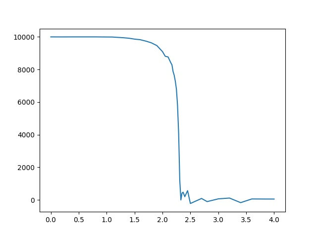

# Ising Model
伊辛模型的Monte Carlo模拟，使用Metropolis抽样

伊辛模型：
* 二维点阵，每个格点上的自旋值S=+1/-1
* 相邻格点之间的相互作用能为-ε * Si * Sj
* 周期性边界条件

Metropolis抽样：
* 一次选择一个格点
* 计算翻转格点自旋所带来的能量差ΔE
* 翻转的概率P：
    * P = exp(-ΔE / kT), ΔE>0
    * P = 1, ΔE<=0

我的[代码实现](./Ising.cpp)，编译：
```
g++ Ising.cpp -o Ising -lm
```
可以从命令行读取参数，修改系统的ε和kT

程序会把每次模拟的数据写进[output.dat](./output.dat)，然后输出系统末态的总磁矩M：
```
./Ising -n 100000 -e 1.0 -T 1.5

Total magnetization: 9880
```
从输出的数据中可以看出：kT = 1.5时，模拟20000次左右即可达到平衡状态

而在温度越来越接近临界温度Tc时，达到平衡所需要的模拟次数逐渐增多。

在kT = 2.0时，需要模拟约50000次才能达到平衡；kT = 2.1时，则需要模拟100000次以上才能达到平衡。

kT > 2.2后，每个温度下均模拟2000万次，由于读写文件时间过长，可以将代码中的读写文件部分去掉，使[程序](./fast_Ising)运行速度更快。
```
./fast_Ising -n 20000000 -T 2.2

Total magnetization: 7990
```
统计得到的数据并作图，得到结果如图所示：<br>
